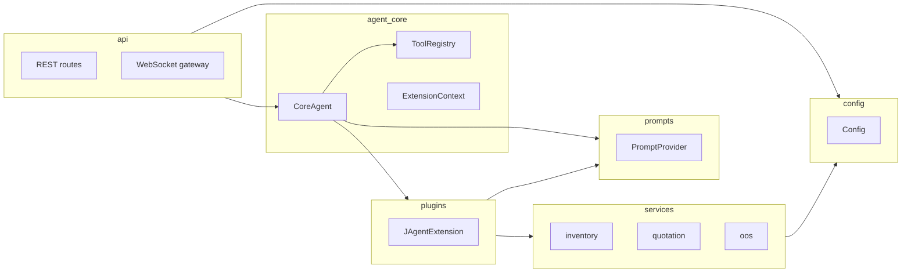

# Agent Team version3 — Backend 分层架构

本文描述后端（`backend/`）的分层与依赖关系，便于开发与 AI 理解模块边界。各层 README 见下方链接。

## 分层概览

**依赖方向**：api → agent_core / plugins → services → config（上层依赖下层，下层不依赖上层）。

## 各层职责与目录

| 层 | 目录 | 职责 |
|----|------|------|
| **agent_core** | `backend/core/` | ReAct 引擎、ToolRegistry、AgentExtension/ExtensionContext、LLM 调用、上下文压缩。不依赖具体业务或 DB。 |
| **plugins** | `backend/plugins/` | 业务扩展：注册工具、提供 skill/output 文本来源（通过 PromptProvider 接口获取）。 |
| **services** | `backend/tools/`（视为服务层） | 领域服务：库存/询价、报价单流程、无货缺货逻辑。对外暴露清晰函数或小接口，内部再调 DB/ERP。 |
| **prompts** | `backend/prompts/` | Prompt 提供方：LocalPromptProvider（读 skills 或本地文件）、可扩展 CloudPromptProvider（读 DB/API）。Extension 依赖「提供方接口」而非具体实现。 |
| **config** | `backend/config.py`（可选 `backend/config/`） | 环境变量与默认值，按层加载。无业务逻辑，仅读 env。 |
| **api** | `backend/server/` | HTTP 路由按领域拆子 router（health、upload、chat、oos、procurement、quotation、work）；WebSocket gateway 独立。 |

## 模块 README 索引

- **[backend/core/README.md](../backend/core/README.md)** — ReAct 引擎、注册表、扩展接口、Public API、与 agent 系统的关系。
- **[backend/plugins/README.md](../backend/plugins/README.md)** — 业务扩展、如何新增 Extension、与 core 和 services 的关系。
- **[backend/plugins/jagent/README.md](../backend/plugins/jagent/README.md)** — JAgent 负责的工具与技能、依赖的 services、如何切换 prompt 来源。
- **[backend/prompts/README.md](../backend/prompts/README.md)** — 统一 prompt 来源、Local vs Cloud、如何接入新 Provider。
- **[backend/tools/README.md](../backend/tools/README.md)** — 各子模块（inventory、quotation、oos）职责、对外入口、依赖的 DB/外部 API。
- **[backend/server/README.md](../backend/server/README.md)** — API 与 WebSocket 入口、路由结构、与 Agent 的调用关系。

## API 路由结构（server/api）

- `routes_health.py` — `/health`、`/api/config/price-levels`
- `routes_upload.py` — `/api/quotation/upload`、`from-text`、`download`
- `routes_chat.py` — `/api/query`、`/api/query/stream`、`/api/master/query`
- `routes_oos.py` — `/api/oos/*`、`/api/business-knowledge`、`/api/shortage/*`
- `routes_procurement.py` — `/api/procurement/approve`
- `routes_quotation.py` — `/api/quotation-drafts/*`、`/api/replenishment-drafts/*`
- `routes_work.py` — `/api/work/run`、`run-stream`、`resume`

聚合入口：`routes.py` 仅 `include_router` 上述子 router，保持 URL 与行为不变。
