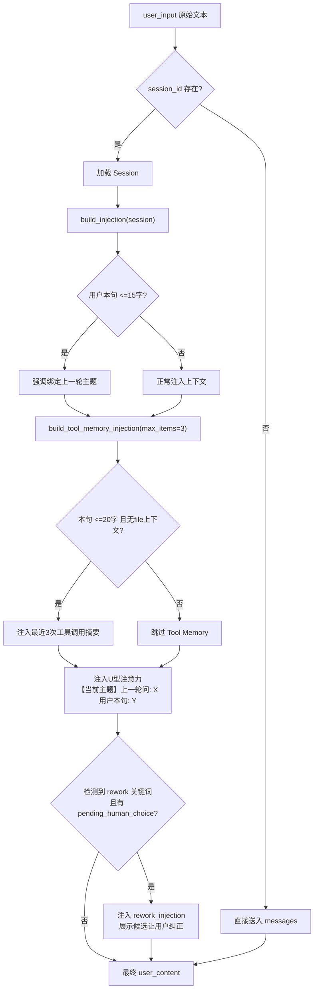
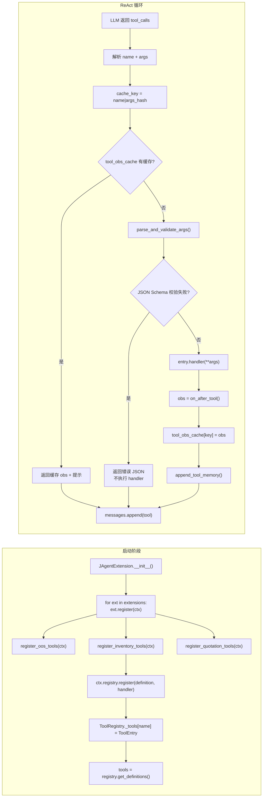
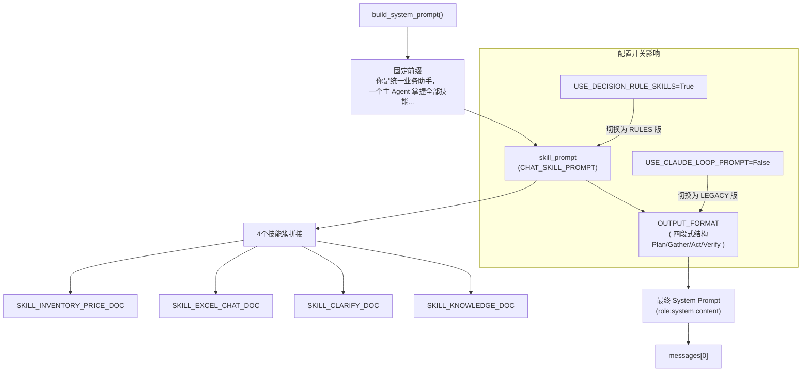

# Chat Mode Agent Prompt 架构全貌

> **文档版本**：V10（Ralph Loop 10 轮迭代完成）
> **生成时间**：2026-03-30
> **适用项目**：Agent Team version3
> **维护者**：cursor-agent
> **状态**：可直接用于 Prompt 调优参考

---

## 目录

| 章节 | 标题 | 核心内容 |
|------|------|----------|
| [1](#1-系统架构总览) | 系统架构总览 | CoreAgent ReAct 循环流程图 |
| [2](#2-system-prompt-构建链路) | System Prompt 构建链路 | `build_system_prompt()` 三段式拼接 |
| [3](#3-skill-prompt-注入链路) | Skill Prompt 注入链路 | JAgentExtension → PromptProvider → skills.py |
| [4](#4-output-format-prompt) | Output Format Prompt | 新版四段式 + LEGACY 版原文 |
| [5](#5-mermaid-时序图) | Mermaid 时序图 | ReAct 循环 / Session 注入 / 工具注册 |
| [6](#6-user_input-注入链路hooks) | user_input 注入链路（Hooks） | on_before_prompt / Session / U型注意力 / Rework |
| [7](#7-toolregistry-详解) | ToolRegistry 详解 | 注册机制 / 参数校验 / 执行超时 |
| [8](#8-sessionstore-详解) | SessionStore 详解 | build_injection / Tool Memory / 持久化 |
| [9](#9-两条-agent-路径对比) | 两条 Agent 路径对比 | agent_runner.py vs core/agent.py |
| [10](#10-关键配置参数) | 关键配置参数 | 10 个核心 Config/环境变量 |
| [11](#11-文件索引) | 文件索引 | 核心文件与作用速查表 |
| [12](#12-错误处理与防御性-prompt-设计) | 错误处理与防御性 Prompt | 6 层防御体系 |
| [13](#13-模型与-token-成本分析) | 模型与 Token 成本分析 | 消耗估算 / 上下文压缩 |
| [14](#14-prompt-版本管理与灰度切换) | Prompt 版本管理与灰度切换 | DOC vs RULES / 新版 vs LEGACY |
| [15](#15-实际调优案例) | 实际调优案例 | 3 个 journal 记录的真实 bugfix |
| [16](#16-可测试性验证方案) | 可测试性验证方案 | 测试分层 / 监控指标 / A/B 框架 |
| [17](#17-context-compression-深度解析) | Context Compression 深度解析 | 压缩策略 / Summarizer |
| [18](#18-prompt-调优检查清单) | Prompt 调优检查清单 | 10 个同步检查点 |
| [19](#19-与写作风格指南对照深度审计) | 与写作风格指南对照（深度审计） | 对照表、资产盘点、差距分析与改版路线 |

---

## 1. 系统架构总览

Agent Team version3 是一个基于 **Single-Agent ReAct** 范式的业务助手系统，通过统一的 `CoreAgent` 引擎驱动所有业务工具（库存查询、价格匹配、Excel 解析、无货登记等）。

```
用户输入 (user_query)
    │
    ▼
┌─────────────────────────────────────────────┐
│  CoreAgent.execute_react()                  │
│                                             │
│  1. Hooks 注入 (on_before_prompt)           │
│     - 语言策略检测                           │
│     - Session 上下文注入                     │
│     - U 型注意力绑定                        │
│     - Rework 检测                           │
│                                             │
│  2. 构建 messages                           │
│     - system: build_system_prompt()         │
│     - user: 注入后的 user_content           │
│                                             │
│  3. ReAct 循环 (max_steps 次)               │
│     - LLM 调用 (GLM-4-flash / GPT-4o-mini)  │
│     - 解析 tool_calls                       │
│     - 执行工具 → observation                 │
│     - Hooks 注入 (on_after_tool)            │
│     - 上下文压缩 (_trim_context)            │
│                                             │
│  4. 返回结果                                │
│     - answer / thinking / trace / error      │
└─────────────────────────────────────────────┘
```

---

## 2. System Prompt 构建链路

System prompt 由 `backend/core/agent_helpers.py` 中的 `build_system_prompt()` 生成：

```python
def build_system_prompt(skill_prompt: str, output_format: str) -> str:
    return (
        "你是统一业务助手，**一个主 Agent 掌握全部技能**，"
        "根据用户意图直接选用下方工具完成目标。无子 Agent，不委托、不转发。\n\n"
        "---\n\n## 技能与工具（按目标选用）\n\n"
        + skill_prompt                           # 技能描述
        + "\n\n---\n\n"
        + (output_format or _CORE_OUTPUT_FORMAT)  # 输出格式约束
    )
```

**最终 system prompt = 固定前缀 + skill_prompt + 输出格式**，三者用 `---` 分隔。

---

## 3. Skill Prompt 注入链路

```
JAgentExtension.__init__(prompt_provider)
        │
        ├── prompt_provider = LocalPromptProvider()
        │       │
        │       └── LocalPromptProvider.get_skill_prompt()
        │               └── skills.CHAT_SKILL_PROMPT
        │                   (= CHAT_SKILL_PROMPT_DOC 或 RULES，取决于配置)
        │
        └── prompt_provider = LocalPromptProvider()
                └── LocalPromptProvider.get_output_format_prompt()
                        └── skills.OUTPUT_FORMAT
```

### 3.1 Skill Prompt 内容（CHAT_SKILL_PROMPT）

技能 prompt 包含 **4 个技能簇**，在 `backend/plugins/jagent/skills.py` 中定义。以下为各技能簇的核心 prompt 原文：

#### SKILL_INVENTORY_PRICE_DOC（库存/价格 — 说明文档风格）

```
**1. 库存与询价/价格**
- **目标**：查库存、查报价、查各档位价格；询价/查 code 时优先 match_quotation
  （历史+万鼎并行取并集，结果带匹配来源），多候选时返回 needs_human_choice，
  由 Agent 自动调用 select_wanding_match 完成 LLM 选型后回复用户。
- **search_inventory(keywords)**：按产品名/规格搜库存，只适配英文。
- **get_inventory_by_code(code)**：已知 10 位物料编号时直接查库存。
- **get_inventory_by_code_batch(codes)**：多个编号（≥5 个）查库存时**必须**使用，
  单次最多 50 条，禁止循环调用 get_inventory_by_code。
- **match_quotation(keywords, customer_level?)**：**询价/查 code 优先工具**。
  同时查历史+万鼎，多候选时 needs_human_choice，Agent **必须**自动调用
  select_wanding_match 完成选型，禁止直接展示 options 列表。
- **match_wanding_price(keywords, customer_level?)**：仅字段匹配（万鼎）。
  用户明确说「用万鼎查」「不要历史」「直接万鼎」时**只调用本工具**。
- **select_wanding_match(keywords, candidates, match_source?)**：**LLM 选型（注入业务知识）**。
  内部注入三角阀≠角阀、PPR/PVC 场景区分等业务规则，降低选错概率。
- **keywords 关键词保护（重要）**：中文管件名称——「直接（接头）」「直通」
  「弯头」「三通」「变径」等——**必须原样保留在 keywords 中，禁止去除**。
  例：「直接dn50」→ keywords=「直接dn50」（❌ 不得简化为「dn50」）
- **档位全名规则**：回复中档位一律用全名，如「出厂价_含税」「（二级代理）A级别」。
- **needs_human_choice 时（重要）**：Agent **必须**自动调用 select_wanding_match，
  禁止直接展示 options 列表让用户自选。
```

#### SKILL_EXCEL_CHAT_DOC（Excel — 说明文档风格）

```
**3. Excel（普适，Chat）**
- **parse_excel_smart(file_path, sheet_name?, max_rows?)**：解析任意 Excel，返回 Markdown 表。
  若用户要实际填表/批量修改，应引导到 Work 页，而不是在 Chat 中用复杂编辑工具。
- 回复时**必须与工具返回的表逐行一致**：照抄全部行，不得只列部分，不得编造行。
- **CRITICAL - Excel 数据展示规则**：`parse_excel_smart` 返回「共 N 行」时，
  表示已成功读取 N 行数据；Markdown 表格第一行是列编号，第二行是表头，
  第三行开始是实际数据。
  **严禁**在 Verify 阶段声称「只有表头」「没有数据行」「似乎为空」。
- 若返回中含「已截断」，请基于已有内容回答，勿再次调用解析工具。
```

#### SKILL_CLARIFY_DOC（澄清 — 说明文档风格）

```
**5. 澄清**
- **ask_clarification(questions, reasoning?)**：当用户意图**不明确**时必须使用：
  - 用户只说「查询XX」「查一下25管卡」，**未指明**是查库存还是价格 → 必须澄清
  - 用户只说「帮我查一下」等极简输入 → 必须澄清
- 只有用户已明确提到「库存」或「价格/报价/万鼎」时，才可直接选用对应工具。
```

#### SKILL_KNOWLEDGE_DOC（业务知识记录 — 说明文档风格）

```
**6. 业务知识记录**
- **append_business_knowledge(content)**：用户要求记录知识/规则/纠正时**必须**调用。
  content 为润色后的完整一条知识，如「PVC160 不是标准规格，应理解为 DN150(6")」。
  无需用户先说「请记住」，用户说「记录到 knowledge 里面」即调用。
- **record_correction_to_knowledge(keywords, confirmed_code, confirmed_name, reasoning)**：
  用户在 rework 流程中确认了正确选项后，Agent **必须**自动调用本工具，
  无需用户明确要求「记录」。
```

#### GLOBAL_HARD_CONSTRAINTS_RULES（跨技能全局硬约束）

```
GLOBAL HARD CONSTRAINTS (CROSS-SKILL)
- NEVER treat any Excel `Qty` / `数量` field as inventory;
  inventory MUST always come only from inventory tools
  (`get_inventory_by_code` / `get_inventory_by_code_batch` / `search_inventory`),
  NOT from any Excel quantity or quotation sheet column.
```

#### SKILL_INVENTORY_PRICE_RULES（库存/价格 — Decision Rules 风格）

```
INVENTORY & PRICE DECISION RULES

[Global Priority Order]
1. Explicit user constraints (e.g.「用万鼎查」「不要历史」)
2. Exact identifiers (e.g. exact 10-digit product code)
3. Language-specific routing (Chinese vs English inventory queries)
4. General defaults and fallbacks

[Routing Rules]
- IF 用户明确要库存/可售 OR 价格/报价/万鼎/档位 → 路由到库存/价格工具
- IF 用户说「用万鼎查」「不要历史」→ 只调 match_wanding_price，**禁止**调 match_quotation
- IF 用户已提供精确 10 位物料编号 → 直接 get_inventory_by_code
- IF 中文库存请求（如「50三通库存」）且无 code →
    必须链路：match_quotation → get_inventory_by_code
    禁止直接 search_inventory（仅适配英文）
- IF 多个产品（≥5 个）查库存 → 必须 get_inventory_by_code_batch，禁止循环调用
- IF needs_human_choice → Agent **必须**自动调用 select_wanding_match
```

### 3.2 配置开关

| 技能簇 | 内容 | 核心工具 |
|--------|------|----------|
| `SKILL_INVENTORY_PRICE_DOC/RULES` | 库存 / 价格查询的行为规范 | `search_inventory`, `match_quotation`, `match_wanding_price`, `select_wanding_match` |
| `SKILL_EXCEL_CHAT_DOC/RULES` | Excel 解析与报价填充 | `parse_excel_smart`, `run_quotation_fill`, `get_profit_by_price_batch` |
| `SKILL_CLARIFY_DOC/RULES` | 意图不明确时的澄清策略 | 工具选择逻辑 |
| `SKILL_KNOWLEDGE_DOC/RULES` | 业务知识（SKU编码、产品分类） | 业务规则注入 |

### 3.2 配置开关

```python
# 决定 skill prompt 版本
use_rules = getattr(Config, "USE_DECISION_RULE_SKILLS", False)
return CHAT_SKILL_PROMPT_RULES if use_rules else CHAT_SKILL_PROMPT_DOC

# 决定 output format 版本
return OUTPUT_FORMAT if getattr(Config, "USE_CLAUDE_LOOP_PROMPT", True) else OUTPUT_FORMAT_LEGACY
```

| Config 字段 | True (默认) | False |
|-------------|-------------|-------|
| `USE_DECISION_RULE_SKILLS` | RULES 版（Decision Rules 风格，严格约束） | DOC 版（说明文档风格） |
| `USE_CLAUDE_LOOP_PROMPT` | OUTPUT_FORMAT（完整四段式 + 全局规则，约 100 行） | OUTPUT_FORMAT_LEGACY（**极简格式**，去掉强制四段式，约 15 行；聚焦工具调用与结果展示，减少约 150–300 tokens/call） |

---

## 4. Output Format Prompt

### 4.1 新版 OUTPUT_FORMAT（当前默认）

来自 `backend/plugins/jagent/skills.py` 中 `OUTPUT_FORMAT` 常量，约 100 行，强制要求 LLM 按 **四段式结构** 输出：

**说明**：`USE_CLAUDE_LOOP_PROMPT=False` 时注入的是 **OUTPUT_FORMAT_LEGACY**（极简格式，约 15 行），去掉强制四段式，改为「think 可省略、直接写 tool_call、结果直接展示、reasoning 由工具 JSON structured 数据透传」。`backend/core/agent_helpers.py` 中的 `_CORE_OUTPUT_FORMAT` 与 LEGACY 同构。默认 `OUTPUT_FORMAT` 保持完整四段式（约 100 行）。

```
## 输出格式（Claude Agent Loop 规范）

每轮推理按以下四段式结构输出 <think> 块，并在需要调用工具时按约定输出 JSON `tool_call`:

## 1. Plan
你 MUST 以半结构化方式输出本轮计划，使用如下字段：
- User Goal: （用一句话概括当前轮要达成的业务目标）
- Intent Type: （inventory | price | excel | clarify | knowledge 等，按主要意图二选一/三选一）
- Relevant Skills: （列出将要用到的技能簇，如 Inventory / Excel Chat / Clarify / Knowledge）
- Planned Tool Chain: （按顺序写出计划使用的工具链路）

## 2. Gather Context
梳理当前已知信息，例如：
- 用户意图与关键约束（如「用万鼎查」「不要历史」「只看 Excel」）
- 会话上下文与最近几轮对话中的关键信息
- 已有的工具返回结果（observation）中可复用的部分
- 仍然缺失的信息

## 3. Act
决定本轮的具体行动：直接回答 / 向用户澄清 / 调用一个工具
如果要调用工具：先用自然语言说明原因，再输出：
<tool_call>
{ "name": "<tool_name>", "arguments": { ... } }
</tool_call>
约束：ONE step = ONE tool call；name 必须与工具名完全一致

## 4. Verify Results
检查是否已获得完成目标所需的关键信息；
检查是否需要继续调用工具或可直接给出最终回答；

**失败恢复规则（Failure Handling Rules）**：
- 工具无结果或明显低质量时：禁止臆造产品/编码/库存/价格/Excel行；
  必须向用户澄清，或尝试替代工具路径（如 match_quotation 无结果→提示万鼎/精准关键词）
- 工具参数无效/缺失时：先在 Plan/Verify 中修正参数或说明问题，再重试

**Tool Call Global Rules（全局约束）**：
- ONE step = ONE tool call（每轮最多一个工具调用）
- name 必须精确匹配工具名（区分大小写）
- NEVER 臆造不存在于用户输入或历史 observation 中的参数值
- NEVER 在可以直接用自然语言回答时滥用工具调用

**Tool Decision Rules（何时必须/禁止调用工具）**：
- 必须调用：用户请求外部数据/系统状态，且所需信息在当前上下文中不可用
- 禁止调用：答案可直接基于现有对话上下文和工具结果推理得出

**批量与多行规则**：涉及多个同类项时，优先使用批量类工具（*_batch）

**多轮指代**：
- 「选哪个」「帮我选一个」「你选」→「必须」调用 select_wanding_match
- 「那个产品」「查这个的库存」→ 用上一轮完整产品名/编号

**格式灵活性**：首轮无 observation 时 Verify 可简写
```

### 4.2 OUTPUT_FORMAT_LEGACY（`USE_CLAUDE_LOOP_PROMPT=False`）

与 **4.1 默认版同构**：均为 **Plan / Gather Context / Act / Verify** 四段式，含精简的 Failure Handling、Tool Call Global、Tool Decision；使用 `</think>`…`</think>` 包裹思考块；**批量 / 多轮指代** 规则在块外简述。

与默认 `OUTPUT_FORMAT` 的差异：**篇幅更短**，省略长示例与部分英文细则；**不**再使用历史上的「目标 / 已知 / 缺失 / 本步行动」无结构三层。切换仍由 `Config.USE_CLAUDE_LOOP_PROMPT` 控制。

**后端 `thinking` 字段**：`backend/core/agent.py` 在 ReAct 循环结束时将各步 `_extract_tag` 得到的思考按步用换行拼接为 `result["thinking"]`；中间步若仅有 `tool_calls`、无最终 `stop`，该步提取到的思考仍会进入 `thinking_parts`——若 UI 未展示，多为前端未渲染 `thinking` 字段或流式展示顺序问题。

---

## 5. Mermaid 时序图

### 5.1 完整 ReAct 循环时序

```mermaid
sequenceDiagram
    participant U as 用户
    participant CA as CoreAgent
    participant LLM as GLM-4-flash
    participant TR as ToolRegistry
    participant Ext as JAgentExtension
    participant SS as SessionStore

    U->>CA: user_query

    rect rgb(240, 248, 255)
        Note over CA: on_before_prompt Hooks
        CA->>Ext: on_before_prompt(user_input, ctx)
        Ext->>Ext: preferred_lang=="en"? 注入英文策略
        CA->>SS: session_id? load session
        CA->>SS: build_injection(session) → 历史上下文
        CA->>SS: build_tool_memory_injection() → 最近3次工具调用
        CA->>CA: 注入U型注意力绑定
        CA->>CA: 检测 rework 意图? 注入 rework_injection
    end

    CA->>CA: build_system_prompt(skill_prompt, output_format)
    CA->>CA: messages = [{role:system, content}, {role:user, content}]

    loop ReAct 循环 (max_steps=12)
        CA->>LLM: chat.completions.create(model, messages, tools)

        alt LLM 不调用工具
            LLM-->>CA: content (最终回答)
            CA->>U: 返回 answer
            exit loop
        else LLM 调用工具
            LLM-->>CA: content + tool_calls

            loop 并行执行每个 tool_call
                CA->>TR: execute(name, args, ctx)
                TR->>TR: parse_and_validate_args (JSON Schema校验)
                TR->>TR: tool.run(**validated_args)
                TR-->>CA: obs (string)

                CA->>Ext: on_after_tool(name, args, obs, ctx)
                Ext->>Ext: run_quotation_fill截断? en+中文翻译提示?
                CA->>SS: append_tool_memory(record)

                CA->>CA: messages.append({role:tool, content:obs})
            end

            CA->>CA: _trim_context (上下文压缩)
        end
    end
```

### 5.2 Session 上下文注入时序



### 5.3 工具注册与调用完整链路



### 5.4 Prompt 组装结构



---

## 6. user_input 注入链路（Hooks）

```
user_input 原始文本
        │
        ▼
┌─────────────────────────────────────────────────────┐
│  1. on_before_prompt (JAgentExtension)               │
│     if preferred_lang == "en":                        │
│         注入英文响应策略（强制英文回答）               │
└─────────────────────────────────────────────────────┘
        │
        ▼
┌─────────────────────────────────────────────────────┐
│  2. Session 上下文注入 (session_id 存在时)            │
│                                                     │
│     a. build_injection()                             │
│        → 历史上下文：上一轮用户问题                    │
│        → 短消息时绑定主题，避免被更早轮次干扰         │
│                                                     │
│     b. build_tool_memory_injection(max_items=3)      │
│        → 最近 3 次工具调用的精简摘要                 │
│        → 仅在短消息（<=20字）且无文件上下文时注入     │
│                                                     │
│     c. U 型注意力绑定                               │
│        → 「【当前主题】上一轮问: X。用户本句: Y」     │
│        → 帮助模型理解本轮与上一轮的关联               │
│                                                     │
│     d. Rework 检测                                  │
│        → 用户说「错了」「不对」且有 pending_human_choice │
│        → 注入 rework_injection 展示候选让用户纠正     │
└─────────────────────────────────────────────────────┘
        │
        ▼
最终 user_content 送入 messages[role=user]
```

---

## 6. 工具注册与调用链路

### 6.1 工具注册（启动时）

```python
class JAgentExtension(AgentExtension):
    def register(self, ctx: ExtensionContext) -> None:
        from backend.tools.oos.handler import register_oos_tools
        from backend.tools.inventory.handler import register_inventory_tools
        from backend.tools.quotation.handler import register_quotation_tools
        register_oos_tools(ctx)         # 无货登记
        register_inventory_tools(ctx)   # 库存 / 价格 / Excel
        register_quotation_tools(ctx)   # 报价单填充
```

### 6.2 工具调用（ReAct 循环中）

```python
# CoreAgent.__init__() 时
self._registry = ToolRegistry()
ctx = ExtensionContext(registry=self._registry, ...)
for ext in extensions:
    ext.register(ctx)
tools = self._registry.get_definitions()  # OpenAI function calling 格式

# ReAct 循环中
for step in range(max_steps):
    resp = client.chat.completions.create(
        model=model,
        messages=messages,
        tools=tools,           # OpenAI function calling 格式
        tool_choice="auto"
    )
    # 解析 tool_calls → execute → observation → on_after_tool → messages
    obs = await self._registry.execute(name, args, ctx)
    obs = ext.on_after_tool(name, args, obs, ctx)  # Hook 处理
    messages.append({"role": "tool", "tool_call_id": tid, "content": obs})
```

### 6.3 on_after_tool Hook

```python
def on_after_tool(self, name, args, obs, context) -> str:
    # 1. run_quotation_fill 结果截断（>3000 chars → 仅保留前 5 条）
    if name == "run_quotation_fill" and len(obs) > 3000:
        data["items"] = items[:5]
        data["_truncated"] = f"共 {len(items)} 条，已截至前 5 条"

    # 2. 英文模式下为中文 observation 附加翻译提示
    if preferred_lang == "en" and contains_chinese(obs):
        obs += "\n\nTranslation note: ..."

    return obs
```

### 6.4 工具结果缓存与去重

```python
cache_key = f"{name}|{json.dumps(args, sort_keys=True)}"
if cache_key in tool_obs_cache:
    obs = cached_obs + "\n\n提示：同一工具和参数已调用过，请直接基于已有结果继续。"
tool_obs_cache[cache_key] = obs
```

### 6.5 Tool Memory（供后续轮次注入）

每轮工具调用后，自动记录结构化摘要：

```python
record = {
    "tool": name,
    "ts": timestamp,
    "args": args,
    "summary": "...",   # 从 JSON 结果中抽取的摘要
    "data": {...}       # 原始数据对象（<4000 chars 时）
}
self._store.append_tool_memory(session_id, record)
```

---

## 7. ToolRegistry 详解

### 7.1 注册机制

`CoreAgent` 在初始化时创建空的 `ToolRegistry`，通过 `ExtensionContext` 分发给各扩展的 `register()` 回调。工具以 `definition + handler` 配对存入内部字典：

```python
class ToolRegistry:
    def __init__(self):
        self._tools: dict[str, ToolEntry] = {}

    def register(self, definition: dict, handler: ToolHandler) -> None:
        name = definition["function"]["name"]
        self._tools[name] = ToolEntry(definition, handler)

    def get_definitions(self) -> list[dict]:
        """返回 OpenAI function calling 格式列表，供 LLM 调用"""
        return [e.definition for e in self._tools.values()]
```

每个 `definition` 的结构（OpenAI function calling 格式）：

```python
{
    "type": "function",
    "function": {
        "name": "search_inventory",
        "description": "按关键词搜索库存产品",
        "parameters": {
            "type": "object",
            "properties": {
                "keywords": {"type": "string", "description": "产品名称或规格关键词"}
            },
            "required": ["keywords"]
        }
    }
}
```

### 7.2 执行与参数校验

```python
async def execute(self, name: str, args: dict, ctx: dict) -> str:
    entry = self._tools.get(name)
    if not entry:
        return tool_error(f"未知工具: {name}", "not_found")

    # JSON Schema 校验（parse_and_validate_args）
    validated_args, error_json = parse_and_validate_args(entry.definition, args, ctx)
    if error_json is not None:
        return error_json  # 校验失败返回错误 JSON，不执行 handler

    # 调用 handler
    result = await entry.handler(**validated_args)
    return result  # 字符串（通常为 JSON 格式）
```

**校验失败不执行 handler** — 这是 ToolRegistry 提供的第一层防御，避免无效参数进入业务逻辑。

### 7.3 工具执行超时与错误处理

```python
async def execute(self, name, args, ctx):
    try:
        result = await tool.run(**kwargs)
    except asyncio.TimeoutError:
        return tool_error(f"工具 {name} 执行超时", "timeout")
    except Exception as e:
        logger.exception(f"工具 {name} 执行失败")
        return tool_error(str(e), "internal_error")
```

---

## 8. SessionStore 详解

### 8.1 Session 数据模型

```python
class Session:
    session_id: str
    turns: List[Turn]                    # 历史问答轮次
    file_path: Optional[str]            # 上传的 Excel 文件路径
    file_id: Optional[str]              # 文件 ID
    excel_meta: Optional[Dict]          # Excel 元信息
    summary: Optional[str]              # 会话摘要（由 LLM 生成）
    tool_memory: Optional[Dict]         # 工具调用记忆
    user_facts: Optional[Dict]          # 用户偏好等长期事实
    pending_human_choice: Optional[Dict] # Rework 待确认选项
```

**Turn 结构**：

```python
class Turn(NamedTuple):
    ts: Optional[float]        # 时间戳
    query: str                 # 用户提问
    answer: str                # Agent 回答
    agent: Optional[str]       # 'single' / 'multi' / None
    input_tokens: Optional[int]
    output_tokens: Optional[int]
```

### 8.2 build_injection 完整逻辑

`build_injection()` 是注入历史上下文的核心方法，其注入内容包括：

```
[会话摘要]                          ← LLM 生成的会话级摘要（避免长对话断层）
[会话上下文 — 最近 N 轮]           ← 最近 4 轮（INJECT_TURNS=4）
  轮次 1 [HH:MM] agent=single
    问: xxx
    答: xxx
  轮次 2 ...
[已上传文件]: filename.xlsx → /path/to/file
[用户偏好]: 客户等级=B；常用规格=DN50  ← user_facts 中非 '_' 开头的 key
【说明】当前用户下一条消息是对上述「最近一轮」的回复...
```

**注入触发条件**：

| 条件 | 注入内容 |
|------|----------|
| 有历史轮次 | `[会话上下文 — 最近 N 轮]` + `[会话摘要]` |
| 有上传文件 | `[已上传文件]` |
| 有 user_facts | `[用户偏好]` |
| 用户本句 <=15 字 | 额外强调"绑定上一轮主题" |

### 8.3 Tool Memory 机制

`append_tool_memory()` 在**每轮工具执行后**自动调用，将结构化记录追加到 `session.tool_memory["recent_tools"]` 列表（上限 50 条）：

```python
record = {
    "tool": "match_quotation",
    "ts": 1743456000000,
    "args": {"keywords": "pvc dn20"},
    "summary": "历史匹配命中 3 条候选，最低含税价 12.5 元",
    "data": {"candidates": [...]}  # <4000 chars 时才保存 data
}
```

`build_tool_memory_injection()` 将最近 3 条记录格式化为：

```
[最近工具调用]
1. match_quotation — 历史匹配命中 3 条候选，最低含税价 12.5 元
2. select_wanding_match — LLM 选择了 [8030020580] PVC DN20...
3. get_inventory_by_code — 库存 500 米，可售 480 米
```

**注入条件**：用户本句 <=20 字且无文件上下文（避免工具记忆干扰文件处理）。

### 8.4 Session 持久化

`SessionStore` 支持磁盘持久化（`persist_dir` 配置），每个 session 存储为 JSON 文件：

```
persist_dir/
  session_abc123.json   # 按 session_id 命名
  session_def456.json
```

轮次超过 `MAX_TURNS=20` 时，旧轮次会被截断（只保留最近 20 轮）。

---

## 9. 两条 Agent 路径对比

| | `agent_runner.py` (Standalone) | `core/agent.py` (Full-featured) |
|---|---|---|
| **System Prompt** | `_system_prompt()` 内联字符串，inventory 专用 | `build_system_prompt(skill_parts, output_fmt)` 拼接所有技能 |
| **Skill Prompt** | 无（仅内联行为指引） | 来自 `JAgentExtension.get_skill_prompt()` |
| **Session/Memory** | 无 | `SessionStore` + Tool Memory + Rework |
| **Excel 摘要** | 无 | `get_excel_summary_for_context()` 自动注入 |
| **多轮上下文** | 无 | `build_injection()` + U型注意力绑定 |
| **Fallback 模型** | 无 | GLM 超时 → GPT-4o-mini 自动切换 |
| **上下文压缩** | 无 | `_trim_context()` 超出上限时自动压缩 |

---

## 10. 关键配置参数

| Config / 环境变量 | 默认值 | 作用 |
|---|---|---|
| `REACT_MAX_STEPS` | 12 | 最大推理步数 |
| `TOOL_RESULT_MAX_CHARS` | 16000 | 单次工具结果截断上限 |
| `TOOL_RESULT_EXCEL_MAX_CHARS` | 100000 | Excel 工具结果截断上限 |
| `CONTEXT_MAX_CHARS` | 16000 | 多轮对话总上下文上限 |
| `LLM_MAX_TOKENS` | 20000 | LLM 输出 token 上限 |
| `USE_DECISION_RULE_SKILLS` | False | Skill Prompt 版本切换 |
| `USE_CLAUDE_LOOP_PROMPT` | True | Output Format 版本切换 |
| `FALLBACK_LLM_*` | 无 | 备用模型配置（超时 fallback） |

---

## 11. 文件索引

| 文件 | 作用 |
|------|------|
| `backend/plugins/jagent/skills.py` | **所有 Skill/Output Format prompt 定义**（核心） |
| `backend/plugins/jagent/extension.py` | `JAgentExtension` — 技能注入 + 工具注册 |
| `backend/core/extension.py` | `AgentExtension` 基类（钩子接口） |
| `backend/core/agent.py` | `CoreAgent` — ReAct 引擎主体 |
| `backend/agent/agent.py` | `SingleAgent` — 向后兼容层 |
| `backend/core/agent_helpers.py` | `build_system_prompt()` / 流式调用 / tag 解析 |
| `backend/prompts/provider.py` | `PromptProvider` 接口 / `LocalPromptProvider` |
| `backend/tools/inventory/services/agent_runner.py` | Standalone ReAct（独立路径） |
| `backend/tools/inventory/services/inventory_agent_tools.py` | 库存工具的 OpenAI function calling 格式定义 |

---

## 12. 错误处理与防御性 Prompt 设计

### 12.1 防御性设计总览

Agent Team version3 的防御性设计分布在多个层面：

| 层级 | 防御机制 | 位置 |
|------|----------|------|
| **LLM 层** | 禁止臆造、必须澄清 | `OUTPUT_FORMAT` (Failure Handling Rules) |
| **LLM 层** | 中文关键词强制保留 | `SKILL_INVENTORY_PRICE_*` (keywords 保护) |
| **LLM 层** | needs_human_choice 强制选型 | `SKILL_INVENTORY_PRICE_*` |
| **LLM 层** | 批量工具强制 batch | `SKILL_INVENTORY_PRICE_*` |
| **LLM 层** | Excel 行对齐禁止编造 | `SKILL_EXCEL_CHAT_*` |
| **LLM 层** | 全局硬约束：Excel Qty ≠ 库存 | `GLOBAL_HARD_CONSTRAINTS_RULES` |
| **ToolRegistry 层** | JSON Schema 参数校验 | `core/registry.py` `parse_and_validate_args()` |
| **ToolRegistry 层** | 未知工具拦截 | `ToolRegistry.execute()` |
| **ToolRegistry 层** | 工具去重缓存 | `tool_obs_cache` |
| **Hook 层** | run_quotation_fill 结果截断 | `on_after_tool()` |
| **Hook 层** | 英文模式中文翻译提示 | `on_after_tool()` |
| **系统层** | max_steps 强制终止 | `CoreAgent.execute_react()` |
| **系统层** | 上下文长度截断 | `TOOL_RESULT_MAX_CHARS` / `_trim_context()` |

### 12.2 LLM 层防御（Prompt 强制约束）

**A. 禁止臆造（Failure Handling Rules）**

```
Failure Handling Rules（失败恢复规则）:
- IF a tool returns no results or only clearly low-quality / irrelevant results,
  - THEN you MUST NOT fabricate 任何产品、编码、库存数量、价格或 Excel 行内容；
  - AND you MUST either:
    - Ask the user for clarification（例如要求更清晰的产品名/规格/code 或确认意图），OR
    - Try an alternative tool path（例如 match_quotation 无结果→提示万鼎/精准关键词）。
```

**B. 中文关键词保护（防止规格被错误简化）**

```
keywords 关键词保护（重要）：
中文管件/产品名称词——「直接（接头）」「直通」「弯头」「三通」「变径」
——即使语法上看似副词或助词，也必须原样保留在 keywords 中，禁止去除。
例：「直接dn50」→ keywords=「直接dn50」（❌ 不得简化为「dn50」）
```

**C. Excel 禁止编造行（数据一致性）**

```
Hard Constraints — MUST FOLLOW:
- DO NOT drop rows, DO NOT duplicate rows to pad the output, DO NOT fabricate rows.
- DO NOT put "数据被截断" or similar placeholders into any cell.
- In Verify phase, DO NOT claim the sheet is empty or "只有表头"
  if parse_excel_smart reported "共 N 行" and returned data rows.
```

**D. 跨技能全局硬约束（Excel Qty ≠ 库存）**

```
GLOBAL HARD CONSTRAINTS (CROSS-SKILL):
- NEVER treat any Excel `Qty` / `数量` field as inventory;
  inventory MUST always come only from inventory tools
  (`get_inventory_by_code` / `get_inventory_by_code_batch` / `search_inventory`),
  NOT from any Excel quantity or quotation sheet column.
```

### 12.3 ToolRegistry 层防御（参数校验）

```python
# core/registry.py — 工具执行入口
async def execute(self, name: str, args: dict, ctx: dict) -> str:
    entry = self._tools.get(name)
    if not entry:
        return tool_error(f"未知工具: {name}", "not_found")

    # JSON Schema 校验（强制校验，失败不执行 handler）
    validated_args, error_json = parse_and_validate_args(entry.definition, args, ctx)
    if error_json is not None:
        return error_json  # 直接返回错误 JSON，handler 不执行

    try:
        result = await entry.handler(**validated_args)
    except asyncio.TimeoutError:
        return tool_error(f"工具 {name} 执行超时", "timeout")
    except Exception as e:
        return tool_error(str(e), "internal_error")
```

校验由 `parse_and_validate_args()` 执行，使用 OpenAPI Schema（jsonschema 库）：
- 必填参数缺失 → 拒绝执行，返回错误 JSON
- 参数类型错误 → 拒绝执行，返回错误 JSON
- 无 jsonschema 时（`import jsonschema` 失败）→ 跳过校验（向后兼容）

### 12.4 工具去重缓存（防止同参数重复调用）

```python
# CoreAgent ReAct 循环中
cache_key = f"{name}|{json.dumps(args, sort_keys=True, default=str)}"
cached_obs = tool_obs_cache.get(cache_key)
if cached_obs is not None:
    obs = (
        f"{cached_obs}\n\n"
        "提示：同一工具和参数在本轮已调用过，请直接基于已有结果继续，不要重复调用。"
    )
    # 不执行 handler，直接返回缓存结果
else:
    obs = await self._registry.execute(name, args, ctx)
    tool_obs_cache[cache_key] = obs
```

**特别保护**：`parse_excel_smart` 有额外的缓存保护 — 若 `get_profit_by_price_batch` 返回 >=20 条后再次调用 `parse_excel_smart`，自动返回提示而非重复执行。

### 12.5 Rework 机制（错误恢复）

当用户说「错了」「不对」时，触发 rework 流程：

```python
# 检测 rework 关键词
_REWORK_KEYWORDS = ["错了", "不对", "不是这个", "重新选", "换一个",
                    "不对，是", "不对，应该是", "选另一个", "换一下"]

def _detect_rework_intent(user_input: str) -> bool:
    return any(kw in user_input for kw in _REWORK_KEYWORDS)

# 当检测到且有 pending_human_choice 时，注入 rework_injection
if _detect_rework_intent(user_input) and session.pending_human_choice:
    rework_injection = _build_rework_injection(session.pending_human_choice)
    user_content += f"\n\n{rework_injection}"
```

注入内容示例：

```
【请确认正确选项】询价「直接50」时有多于候选，系统已按规则预选，但您可以推翻并指出正确选项：
  1. [8030020580] 直接50 (来源: 字段匹配)
  2. [8030020590] 直接50 (来源: 历史报价)
请直接回复选项序号或产品名称，指出正确选项。
```

---

---

## 13. 模型与 Token 成本分析

### 13.1 模型配置

| 字段 | 主模型 | 备用模型 |
|------|--------|----------|
| **模型名称** | `glm-4-flash` | `gpt-4o-mini` |
| **Base URL** | `https://open.bigmodel.cn/api/paas/v4` | 可配置 |
| **API Key** | `LLM_API_KEY` | `FALLBACK_LLM_API_KEY` |
| **触发条件** | 正常调用 | GLM 超时或 API 错误时自动切换 |

Fallback 逻辑：

```python
# core/agent.py
try:
    resp = client.chat.completions.create(**kwargs)
except (openai.APITimeoutError, openai.APIConnectionError):
    if self._fallback_client and self._fallback_model:
        logger.warning("本步模型调用超时，fallback 到备用模型: %s", self._fallback_model)
        fb_kwargs = {**kwargs, "model": self._fallback_model}
        resp = self._fallback_client.chat.completions.create(**fb_kwargs)
```

### 13.2 Token 消耗估算

| 阶段 | 消耗来源 | 上限配置 |
|------|----------|----------|
| **System Prompt** | skill_prompt + output_format（约 5000-8000 tokens） | 固定 |
| **User Input** | 用户输入 + 各类 injection | 动态 |
| **Tool Observation** | 每次工具返回结果 | `TOOL_RESULT_MAX_CHARS=16000`（约 4000 tokens） |
| **多轮累积** | messages 历史 + tool 结果 | `CONTEXT_MAX_CHARS=16000`（压缩触发） |

**单轮典型 Token 分布**：

```
System Prompt: ~6000 tokens（skill_prompt ~5000 + output_format ~1000）
User Content:  ~200 tokens（用户输入 + 各类 injection）
Tool Result:   ~2000 tokens（observation，平均）

第一次 LLM 调用: ~8200 tokens（输入）
第一次 LLM 输出: ~500 tokens（典型回答）

多轮累积（3步）:
  messages[0] system: ~6000
  messages[1] user: ~200
  messages[2] assistant: ~100
  messages[3] tool: ~2000
  messages[4] user (trimHint): ~50
  ...
  → 若超过 CONTEXT_MAX_CHARS=16000，触发 _trim_context() 压缩
```

### 13.3 上下文压缩机制（_trim_context）

```python
# core/context_compression.py
def _trim_context(messages, max_chars, id_to_name, summarizer):
    """当消息列表总字符超限时，压缩历史 tool 结果"""
    total = sum(len(m["content"]) for m in messages if isinstance(m["content"], str))
    if total <= max_chars:
        return  # 不需要压缩
    # 策略：对 tool 消息进行压缩/摘要
    # summarizer 是独立 LLM（gpt-4o-mini），用于生成 tool 结果摘要
```

**压缩触发条件**：`CONTEXT_MAX_CHARS=16000`，按累计字符计算。

**Summarizer 配置**：

```python
summarizer = make_summarizer(
    Config.SUMMARY_LLM_API_KEY or Config.OPENAI_API_KEY,
    (Config.SUMMARY_LLM_BASE_URL or Config.OPENAI_BASE_URL or "").strip() or None,
    getattr(Config, "SUMMARY_LLM_MODEL", "gpt-4o-mini"),
    timeout=3.0,
)
```

### 13.4 成本优化策略

| 策略 | 实现 | 效果 |
|------|------|------|
| Tool Result 截断 | `TOOL_RESULT_MAX_CHARS=16000` | 防止单次 tool 返回过大 |
| Excel 单独上限 | `TOOL_RESULT_EXCEL_MAX_CHARS=100000` | Excel 允许更大结果但仍截断 |
| 去重缓存 | `tool_obs_cache` | 避免同参数重复调用 |
| Tool Memory 截断 | `summary = text[:180]` | tool_memory injection 不超过 180 字 |
| 上下文压缩 | `_trim_context` + summarizer | 超出上限时用摘要替代完整结果 |
| Batch 工具 | `*_batch` 工具（50条上限） | 减少循环次数 |
| build_injection 截断 | `INJECT_ANSWER_TRIM=2000` | 注入的回答最多 2000 字 |

---

## 14. Prompt 版本管理与灰度切换

### 14.1 版本切换架构

```
skills.py 常量（版本A / 版本B）
        ↑
JAgentExtension.get_skill_prompt()
        ↑
LocalPromptProvider.get_skill_prompt()
        ↑
SingleAgent.__init__(prompt_provider=None)
        ↓
CoreAgent.__init__(extensions=[ext])
        ↓
build_system_prompt(skill_parts, output_fmt)  ← 拼入 system prompt
```

### 14.2 切换开关

| Config 字段 | 影响范围 | 默认值 |
|-------------|----------|--------|
| `USE_DECISION_RULE_SKILLS` | skill_prompt 内容：DOC ↔ RULES | `False` |
| `USE_CLAUDE_LOOP_PROMPT` | output_format 内容：新版 ↔ LEGACY | `True` |

```python
# JAgentExtension.get_skill_prompt()
use_rules = getattr(Config, "USE_DECISION_RULE_SKILLS", False)
return CHAT_SKILL_PROMPT_RULES if use_rules else CHAT_SKILL_PROMPT_DOC

# JAgentExtension.get_output_format_prompt()
return OUTPUT_FORMAT if getattr(Config, "USE_CLAUDE_LOOP_PROMPT", True) else OUTPUT_FORMAT_LEGACY
```

### 14.3 版本说明

**SKILL 版本对比**：

| | DOC 版 | RULES 版 |
|---|---|---|
| **风格** | 说明文档式（告诉 LLM 工具是什么、怎么用） | Decision Rules 风格（if-then 强制路由） |
| **适用场景** | 通用场景、规则相对简单 | 复杂决策、需要强制约束的场景 |
| **约束强度** | 中等（描述性） | 强（强制路由规则） |
| **可读性** | 较高 | 较低（规则密集） |

**OUTPUT_FORMAT 版本对比**：

| | 新版（OUTPUT_FORMAT） | LEGACY 版（OUTPUT_FORMAT_LEGACY） |
|---|---|---|
| **结构** | Plan/Gather/Act/Verify 四段式（约 100 行） | **极简格式**（约 15 行），think 可省略，无强制分段 |
| **reasoning 说明** | 工具 JSON structured 数据由 UI 渲染，模型不需要在 think 里复述 | 同上（已在极简版显式说明） |
| **Failure Handling** | 完整英文+中文细则 | 精简要点（同语义） |
| **Tool Decision Rules** | 完整双列表 | 精简为两条判断 |
| **适合场景** | 默认生产、强约束与可测性 | `USE_CLAUDE_LOOP_PROMPT=False` 时减约 150–300 tokens/call |

### 14.4 灰度切换策略

生产环境推荐灰度切换方式：

```
1. 独立部署两套配置：
   - 实例A: USE_DECISION_RULE_SKILLS=False（DOC版）
   - 实例B: USE_DECISION_RULE_SKILLS=True（RULES版）

2. 流量分配：
   - 初期：90% 实例A / 10% 实例B
   - 观察稳定后：50% / 50%
   - 确认无问题：100% 新版

3. 监控指标：
   - 每轮平均工具调用次数
   - needs_human_choice 触发率
   - 成功率 / 错误率
   - 平均 ReAct 步数
```

---

## 15. 实际调优案例

以下案例均来自 `cursor-agent` journal 记录的真实 bugfix，可作为 Prompt 调优决策的参考。

### 案例 1：skills.py 与代码行为不同步（2026-03-29）

**问题**：
用户说"直接50 价格"，系统返回候选列表而不是自动选型后的结果。

**根因分析**：

```
代码已实现：match_quotation 返回 needs_human_choice=true 时
           Agent 必须自动调用 select_wanding_match

但 skills.py 仍然描述的是旧行为：
           "needs_selection" → 直接展示 options 让用户选

结果：Prompt 告诉 LLM 一种行为，实际代码是另一种
     → LLM 按 skills.py 描述行动 → 行为不符预期
```

**修复方案**：

在 `skills.py` 中搜索所有描述 `needs_selection` 的位置，替换为新的 `needs_human_choice` 规则：

```
# 修改前（错误）
IF 返回 needs_selection → 展示 options 列表让用户自选

# 修改后（正确）
IF 返回 needs_human_choice: true → Agent 必须自动调用
  select_wanding_match 进行 LLM 选型，禁止直接展示 options 列表
```

**教训**：

> **`skills.py` 是 Agent 行为的唯一事实来源**。
> - `agent_runner.py` 的 `_SYSTEM_PROMPT` 仅用于 Standalone 路径
> - `JAgentExtension` 通过 `skills.py` 注入 Prompt
> - 任何 Agent 行为变更**必须**同时更新 `skills.py`，然后**重启 backend**
> - `skills.py` 修改**不会**热加载

### 案例 2：中文尺寸规格无法识别（2026-03-29）

**问题**：

系统无法识别中文尺寸单位，如：
- `2寸` → 应该是 DN50
- `1寸` → 应该是 DN25
- `6英寸` → 应该是 DN150

**根因分析**：

```
matching flow:
_split_tokens 提取 "2寸" 作为 token
    ↓
_expand_unit_tokens 无法扩展 "2寸"
    ↓
无匹配 → 返回 unmatched
```

`wanding_fuzzy_matcher.py` 中的 `_expand_unit_tokens` 只有英文扩展（如 `2"` → `DN50`），没有中文口语形式的映射。

**修复方案**：

在 `wanding_fuzzy_matcher.py` 中添加中文尺寸映射：

```python
CUN_TO_MM = {
    "2寸": "DN50", "1½寸": "DN40", "3/4寸": "DN20",
    "1寸": "DN25", "6英寸": "DN150",
}
```

同时更新 `SKILL_INVENTORY_PRICE_*` 中的 **keywords 关键词保护** 规则：

```
中文管件名称词——「直接（接头）」「直通」「弯头」「三通」
——必须原样保留在 keywords 中，禁止去除。
例：「直接dn50」→ keywords=「直接dn50」（不得简化为「dn50」）
```

**教训**：

> **中文口语形式的规格需要显式映射**，不能依赖模型做隐式理解。
> - 明确的中文关键词保护规则防止 model 自行简化用户输入
> - 维护中文规格→标准格式的映射表
> - Prompt 中的 keywords 保护规则需要与代码中的扩展逻辑同步

### 案例 3：两阶段 LLM 选型机制设计（2026-03-29）

**背景**：从一次性选型改为两阶段可见选型。

**实现方案**：

```
match_quotation
    ↓ 单一候选
直接返回 chosen + 库存
    ↓ 多候选（needs_human_choice: true）
Agent 自动调用 select_wanding_match（注入业务知识）
    ↓ LLM 基于万鼎业务规则选型
返回 single 结果
    ↓ 回复用户
```

**业务知识注入**（`select_wanding_match` 内部）：
- 三角阀 ≠ 角阀
- PPR / PVC 场景区分
- 规格精确匹配优先

**Prompt 关键约束**：

```
IF needs_human_choice → Agent 必须自动调用 select_wanding_match
   禁止直接展示 options 列表让用户自选
   必须等收到 single 结果后再回复用户

用户要「全部价格/所有候选/列出所有」→ 不调 select_wanding_match
   直接用 observation 中 options 整表回复
```

---

## 16. 可测试性验证方案

### 16.1 测试分层

```
┌─────────────────────────────────────┐
│  E2E 测试（完整 ReAct 循环）         │ ← 最高成本，最高置信度
│  test_e2e_chat.py                   │
├─────────────────────────────────────┤
│  Prompt 行为测试（模拟 LLM 调用）     │ ← 中等成本
│  test_prompt_behavior.py             │
├─────────────────────────────────────┤
│  单元测试（工具 handler 独立测试）    │ ← 最低成本，最低置信度
│  test_wanding_fuzzy_matcher.py       │
└─────────────────────────────────────┘
```

### 16.2 Prompt 行为测试设计

```python
# test_prompt_behavior.py — 验证 LLM 对特定输入的工具选择

CASES = [
    {
        "name": "中文库存查询 → 必须 match_quotation",
        "user_input": "查一下50三通的库存",
        "expected_tool": "match_quotation",
        "expected_chain": ["match_quotation", "get_inventory_by_code"],
    },
    {
        "name": "needs_human_choice → 必须调用 select_wanding_match",
        "user_input": "直接50 价格",
        "mock_observe": {"needs_human_choice": True, "options": [...]},
        "expected_tool": "select_wanding_match",
    },
    {
        "name": "多产品(≥5) → 必须 batch 工具",
        "user_input": "帮我查一下 dn20 dn25 dn32 dn40 dn50 dn65 的库存",
        "expected_tool": "get_inventory_by_code_batch",
    },
    {
        "name": "Excel 解析 → 必须 row-aligned",
        "user_input": "看一下这张表的内容",
        "expected_constraint": "no_fabricated_rows",
    },
]

def test_prompt_routing():
    for case in CASES:
        result = simulate_llm_call(case["user_input"], mock_observe=case.get("mock_observe"))
        assert result["tool_name"] == case["expected_tool"], f"Case failed: {case['name']}"
```

### 16.3 关键监控指标

| 指标 | 计算方式 | 健康范围 |
|------|----------|----------|
| **选错工具率** | Agent 调用了错误工具的轮次 / 总轮次 | < 5% |
| **参数错误率** | JSON Schema 校验失败次数 / 总调用次数 | < 2% |
| **臆造率** | 发现臆造产品/价格/库存的轮次 / 总轮次 | < 1% |
| **平均 ReAct 步数** | 总步数 / 成功完成的任务数 | 1.5 ~ 3.5 |
| **needs_human_choice 触发率** | 触发 LLM 选型次数 / 总价格查询次数 | 10% ~ 30% |
| **Batch 工具使用率** | 使用 batch 工具的多产品查询 / 总多产品查询 | > 80% |

### 16.4 A/B 测试框架

```python
# 用于比较两个 prompt 版本的效果
def run_ab_test(prompt_version_a, prompt_version_b, test_cases, n=100):
    results_a = []
    results_b = []
    for _ in range(n):
        for case in test_cases:
            result_a = run_agent(prompt_version_a, case)
            result_b = run_agent(prompt_version_b, case)
            results_a.append(result_a)
            results_b.append(result_b)

    return {
        "version_a": summarize(results_a),
        "version_b": summarize(results_b),
        "delta": diff_summaries(results_a, results_b),
    }
```

---

## 17. Context Compression 深度解析

### 17.1 触发条件

`_trim_context` 在每次 ReAct 循环结束时调用：

```python
# core/agent.py
for step in range(max_steps):
    # ... LLM 调用，工具执行 ...
    id_to_name = build_tool_call_id_to_name(messages)
    summarizer = make_summarizer(...)
    _trim_context(messages, _CONTEXT_MAX_CHARS, id_to_name, summarizer)
```

触发阈值：所有 messages 的 content 总字符数 > `CONTEXT_MAX_CHARS`（默认 16000）

### 17.2 压缩策略

```python
def _trim_context(messages, max_chars, id_to_name, summarizer):
    total = sum(len(m["content"]) for m in messages
                if isinstance(m["content"], str))
    if total <= max_chars:
        return  # 无需压缩

    # 压缩策略：优先压缩旧的 tool messages
    # 保留最新的 system + user + 最近 2 条 tool messages
    # 对更旧的 tool messages 用 summarizer 生成摘要替代
```

### 17.3 Summarizer 配置

```python
summarizer = make_summarizer(
    api_key=Config.SUMMARY_LLM_API_KEY or Config.OPENAI_API_KEY,
    base_url=(Config.SUMMARY_LLM_BASE_URL or Config.OPENAI_BASE_URL or "").strip() or None,
    model=getattr(Config, "SUMMARY_LLM_MODEL", "gpt-4o-mini"),
    timeout=3.0,
)
# 使用独立的小模型生成摘要，降低成本
```

---

## 18. Prompt 调优检查清单

调整 prompt 时需同步检查的位置：

```
[1] 工具选择逻辑/约束         →  backend/plugins/jagent/skills.py  (SKILL_INVENTORY_PRICE_*)
[2] 输出格式/思考结构         →  backend/plugins/jagent/skills.py  (OUTPUT_FORMAT)
[3] 失败恢复/禁止臆造规则     →  backend/plugins/jagent/skills.py  (OUTPUT_FORMAT 中的 Verify)
[4] 多轮指代/上下文绑定策略   →  backend/core/agent.py  (build_injection / U型注意力)
[5] Rework 机制触发词         →  backend/core/agent.py  (_REWORK_KEYWORDS)
[6] Session 记忆注入策略       →  backend/core/agent.py  (append_tool_memory / build_tool_memory_injection)
[7] 工具结果后处理            →  backend/plugins/jagent/extension.py  (on_after_tool)
[8] System Prompt 固定前缀     →  backend/core/agent_helpers.py  (build_system_prompt)
[9] 独立路径 agent_runner.py  →  backend/tools/inventory/services/agent_runner.py  (_system_prompt)
```

**写作风格（Claude Code 式）补充勾选项**（详见 [§19](#19-与写作风格指南对照深度审计) / [Prompt_Style_Guide_Crosswalk.md](./Prompt_Style_Guide_Crosswalk.md)）：

```
[10] 否定式约束               →  关键禁止行为是否用 Don't / MUST NOT / 禁止 写清，而非仅「尽量」
[11] 量化边界                 →  Gather/Verify 外，最终回复是否需字数/条数上限（业务自定）
[12] think 标签与解析器        →  agent_helpers._extract_tag(tag="think") 与 skills 中 OUTPUT_FORMAT 示例是否一致
[13] DOC vs RULES 语义漂移      →  同一条路由规则在 DOC / RULES 两侧是否仍等价
[14] 测试字符串耦合           →  tests/test_integration_agent_react.py 是否需随 OUTPUT_FORMAT 改版
```

---

## 19. 与写作风格指南对照（深度审计）

以仓库外《Claude-Code-Prompt写作风格指南》为标尺，对 **固定前缀 + skill_prompt + output_format** 三块及 `llm_selector` 二次模型 prompt 做的体系化审计（映射表、字符数实测、差距分析、分批改版路线与验证矩阵）已单列为：

- **[doc/Prompt_Style_Guide_Crosswalk.md](./Prompt_Style_Guide_Crosswalk.md)**

架构本文档保持 **V10 链路说明**；审计文档随 `skills.py` / `agent_helpers.py` 大段 prompt 变更时更新「字符数表」与差距结论即可。

---

*本文档为 Agent Team version3 Chat Mode Agent Prompt 架构的完整快照，供 prompt 调优参考。*
